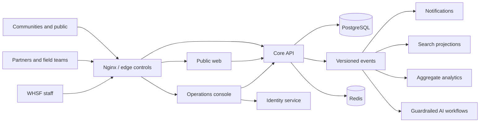

# Platform architecture

## Context

The platform separates public communication, trusted operations, identity, programme delivery, and derived capabilities so sensitive humanitarian data is not exposed through the public website or copied without purpose.

## Application boundaries

- `apps/web` is the public and partner-entry experience. Public pages should remain cacheable and collect no sensitive information.
- `apps/admin` is a restricted operations surface. It must remain unavailable outside trusted identity enforcement until Milestone 2.
- `apps/docs` publishes versioned technical and operator guidance.
- `apps/storybook` is the Aurora component contract and accessibility workbench.

## Service boundaries

The core API owns programme and partner system-of-record contracts. Identity, delivery, search, analytics, and AI are separate ownership boundaries. Derived services receive purpose-limited events and cannot read primary database tables.

## Data principles

1. Every protected record is scoped to an organisation and includes audit fields.
2. Sensitive fields are encrypted with managed keys in production.
3. Events contain the minimum data required by a named consumer.
4. AI and analytics outputs are derived, reviewable, and never authoritative records.
5. Deletion, retention, and legal holds are explicit domain operations—not ad-hoc database scripts.

## Reliability

Services expose liveness and readiness separately. Requests carry correlation IDs through proxy and application logs. Deployment health, error budgets, recovery time, and recovery point objectives are finalized with the production infrastructure decision.
